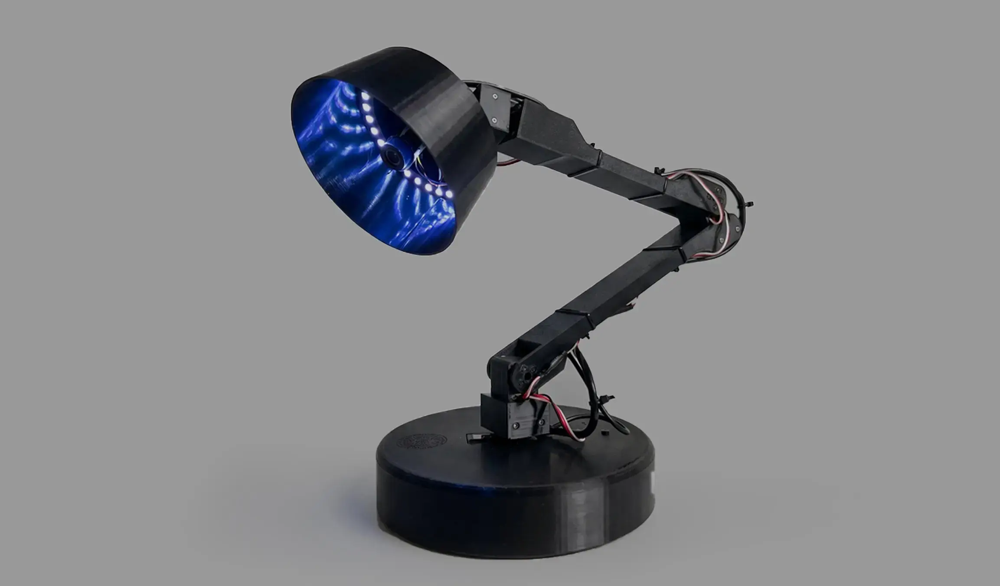
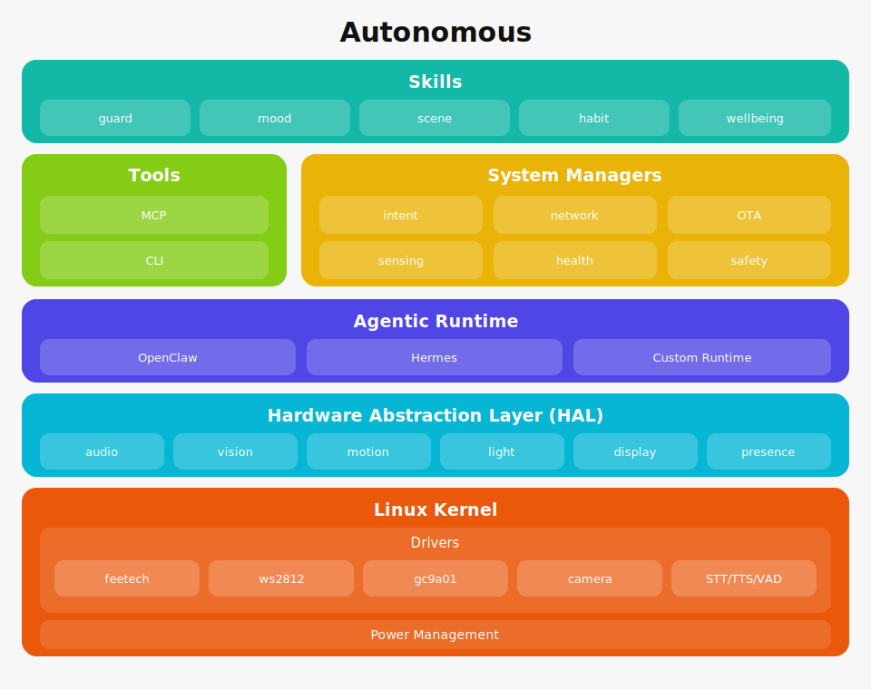

# Autonomous

**Autonomous is the open-source OS for physical AI agents.** It runs on edge devices
with cameras, microphones, speakers, displays, motors, lights, and sensors, and gives
an AI agent a body: it sees, hears, speaks, moves, senses, remembers, runs skills, and
updates itself — locally first.

**Autonomous Lamp** is the first reference device. **Intern** is the second. Anyone can
build a third.

> The brain is a swappable **agentic runtime** (OpenClaw, Hermes, or any LLM + skills +
> memory). Autonomous is everything else — the body, the skills, and the bounds.

## Reference devices

| | Device | What it is | Declares |
|---|--------|-----------|----------|
|  | [**Autonomous Lamp**](devices/lamp) | 5-DOF expressive desk robot | the maximal set — audio, vision, motion, light, display, sensing |
|  | [**Autonomous Intern**](devices/intern) | always-on desk agent | audio, vision, sensing — **no** motion or display |

Lamp and Intern run the **same OS image**. The only difference is which capabilities each
device's `DEVICE.md` declares. That is the whole thesis: a new device is a `DEVICE.md`,
not a fork.

## Architecture

Autonomous is a layered stack: each layer exposes an interface to the one above and
depends only on the one below, so any layer can be replaced without touching the others.
(The layering follows Android; the driver/board split follows Linux.)



### Skills

What the device does: `guard`, `mood`, `scene`, `habit`. Each is a `SKILL.md`
the runtime invokes. A skill is an *ability*; it is not the device's *character* — that's
its `SOUL.md`. First-party skills use the same public contract a third party gets.
*(`os/core/resources/openclaw-skills`)*

### Agentic Runtime

OpenClaw, Hermes, or any LLM + skills + memory runtime. It runs the
skills, embodies the device's `SOUL.md`, and decides what to act on. Swappable — and where
Autonomous's differentiated value (the default brain, memory, character) lives.
*(`os/core/internal/openclaw`)*

### System Services

The always-on device daemon, in Go: `intent` (fast local commands),
`network`, `OTA`, `sensing` routing, the `skill` manager, health and logging. Runs with or
without the runtime. *(`os/core`)*

### HAL — Capabilities

The frozen, versioned interface between software and hardware:
`audio.speak`, `motion.move`, `vision.snapshot`. Skills call capabilities, never hardware
models, so one skill runs on any body that declares the capability. A device's `DEVICE.md`
declares which it has; the runtime mounts only those. *(`contract/` — see [HAL](docs/architecture/hal.md))*

### Drivers

Each talks to one piece of hardware: the feetech servo, ws2812 LED, gc9a01
display, camera, the audio STT/TTS/VAD pipeline. *(`os/hal/lelamp/service`)*

### Board Support

Per-board wiring (GPIO lines, PWM-vs-SPI LED, touch) for Raspberry Pi
4/5 and OrangePi. One profile per board; swapping silicon is a port, not a rewrite.
*(`os/hal/lelamp/platform/board.py`)*

### Linux Kernel

The vendor kernel (Raspberry Pi OS / OrangePi) we run on. We don't ship
a kernel; drivers use its userspace interfaces (GPIO, SPI, ALSA, V4L2). *(see [kernel](docs/architecture/kernel.md))*

### Safety

The floor. The e-stop, motion limits, thermal cutoff, and fail-safe behavior
are enforced by deterministic policy, never by the runtime. `SOUL.md` is at the top (mutable
character); `SAFETY.md` is at the bottom (immutable bounds) — character can't override the
floor. *(`devices/<id>/SAFETY.md`)*

📖 Full docs: [overview](docs/architecture/overview.md) · [HAL](docs/architecture/hal.md) · [kernel](docs/architecture/kernel.md)

## The Autonomous Physical Agent Standard

Every device is self-describing to both humans and the runtime, in four files:

| File | Role | Consumer |
|------|------|----------|
| `DEVICE.md` | the **body** — what hardware is present | the OS, at boot |
| `SKILL.md` | the **hands** — what it can do | the runtime |
| `SOUL.md` | the **self** — who it is | the runtime |
| `SAFETY.md` | the **bounds** — what it must never do | the OS (deterministic) |

The contract that governs them lives under [`contract/`](contract/) — see
[`DEVICE-SPEC.md`](contract/DEVICE-SPEC.md) and [`capabilities.md`](contract/capabilities.md).

## Repository layout

```
contract/         FROZEN — DEVICE-SPEC, capability vocabulary (the ABI third parties build on)
os/
  core/           Go system services: intent, network, OTA, sensing routing, runtime bridge
    web/          on-device setup + monitor UI (React)
  hal/lelamp/     Python hardware runtime — drivers + the capability host
    platform/     board profiles + declaration-driven capability mounting
devices/          per-device: lamp/ (DEVICE · SOUL · SAFETY · README · hardware/), intern/, examples/
companions/       lamp-buddy (macOS) · desktop-buddy
docs/  imager/  scripts/
```

## Quick start

```bash
# Go system services (cross-compiled to linux/arm64 — Pi or OrangePi)
make lamp-build            # builds the system server (os/core)
make lamp-test             # go test ./...

# Hardware runtime (runs on the Pi or OrangePi)
cd os/hal/lelamp && uv sync
make lelamp-dev            # uvicorn reload on :5001
make lelamp-test           # pytest

# Web UI
make web-install && make web-dev
```

## API convention

All HTTP endpoints return `{"status": 1, "data": <payload>, "message": null}` on success
and `{"status": 0, "data": null, "message": "error"}` on failure.

## Governance & license

Autonomous (the OS) is **Apache 2.0** and fully open. Premium souls, the memory continuity
service, Grid inference, and the skill store ship separately — open core, commercial
services on top. The project is BDFL-governed. See [`GOVERNANCE.md`](GOVERNANCE.md),
[`CONTRIBUTING.md`](CONTRIBUTING.md), and [`MAINTAINERS`](MAINTAINERS).

Build an **Autonomous-compatible** device: write a `DEVICE.md`, implement any missing
drivers against the HAL contract, ship a `SOUL.md`. You never fork the OS.
