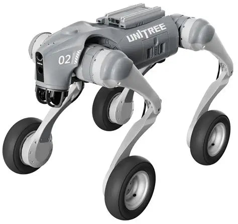

# Autonomous

**Autonomous is the open source operating system for physical AI agents.** It runs on edge devices
with cameras, microphones, speakers, displays, motors, lights, and sensors, and gives
an AI agent a body: it sees, hears, speaks, moves, senses, remembers, runs skills, and
updates itself — locally first.

**Autonomous Lamp** is the first reference device. **Intern** is the second. Anyone can
build a third.

> The brain is a swappable **agentic runtime** (OpenClaw, Hermes, or any LLM + skills +
> memory). Autonomous is everything else — the body, the skills, and the bounds.

## Reference devices

| | Device | What it is | Declares |
|---|--------|-----------|----------|
|  | [**Autonomous Lamp**](devices/lamp) | 5-DOF expressive desk robot | the maximal set — audio, vision, motion, light, display, sensing |
|  | [**Autonomous Intern**](devices/intern) | always-on desk agent | audio, vision, sensing — **no** motion or display |
|  | [**Unitree Go2-W**](devices/unitree-go2w) | a *different manufacturer's* mobile robot, running Autonomous | audio, vision (+ depth), motion (locomotion), sensing |

Lamp and Intern are **Autonomous's own** devices; the **Unitree Go2-W is a different
manufacturer's** robot running the identical OS — the Android playbook (Android on Samsung,
Pixel, …). All three run the **same OS image**; only their `DEVICE.md` differs. The Go2-W makes
it vivid: its `motion` is **locomotion** driven by the Unitree SDK, yet a "come here" skill
calling `motion.move` runs on it and on Lamp alike — skills address capabilities, not hardware.

## Architecture

Autonomous is a layered stack: each layer exposes an interface to the one above and
depends only on the one below, so any layer can be replaced without touching the others.
(The layering follows Android; the driver/board split follows Linux.)


### Skills

What the device does: `guard`, `mood`, `scene`, `habit`, `wellbeing`. Each is a `SKILL.md`
the runtime invokes. A skill is an *ability*; the device's *character* is its `SOUL.md`.
First-party skills use the same public contract a third party gets. *(`skills/`)*

### Tools

How the runtime reaches beyond the device — **MCP** servers and the **CLI**. Skills are the
device's own abilities (through the HAL); tools are external capabilities the runtime calls.

### System Managers

The always-on Go daemon: `intent` (fast local commands), `network`, `OTA`, `sensing` routing,
`health`, and `safety`. Deterministic — they run with or without the runtime, and
**safety-critical actions (e-stop, motion limits) are enforced here, never by the LLM**.
*(`os/services`)*

### Agentic Runtime

**OpenClaw**, **Hermes**, or a custom runtime. Runs the skills, embodies the device's
`SOUL.md`, and decides what to act on. Swappable — and where Autonomous's differentiated
value (the default brain, memory, character) lives. *(`os/services/internal/openclaw`)*

### Hardware Abstraction Layer (HAL)

The frozen, versioned interface: `audio`, `vision`, `motion`, `light`, `display`, `presence`.
Skills call capabilities (`motion.move`), never hardware models — so one skill runs on any
body that declares the capability. A device's `DEVICE.md` declares which it has; the runtime
mounts only those. *(`contract/` + `os/hal` — see [HAL](docs/architecture/hal.md))*

### Linux Kernel

The vendor kernel (Raspberry Pi OS / OrangePi, or the robot's onboard compute) we run on — we
don't ship one. Our **Drivers** (`feetech`, `ws2812`, `gc9a01`, `camera`, `STT/TTS/VAD` in
`os/hal/drivers`, with per-board wiring in `os/hal/board`) are userspace programs talking to
it through GPIO/SPI/ALSA/V4L2; **Power Management** is the foundation.
*(see [kernel](docs/architecture/kernel.md))*

📖 Full docs: [overview](docs/architecture/overview.md) · [HAL](docs/architecture/hal.md) · [kernel](docs/architecture/kernel.md)

## The Autonomous Physical Agent Standard

Every device is self-describing to both humans and the runtime, in four files:

| File | Role | Consumer |
|------|------|----------|
| `DEVICE.md` | the **body** — what hardware is present | the OS, at boot |
| `SKILL.md` | the **hands** — what it can do | the runtime |
| `SOUL.md` | the **self** — who it is | the runtime |
| `SAFETY.md` | the **bounds** — what it must never do | the OS (deterministic) |

The contract that governs them lives under [`contract/`](contract/) — see
[`DEVICE-SPEC.md`](contract/DEVICE-SPEC.md) and [`capabilities.md`](contract/capabilities.md).

## Repository layout

The tree maps onto the architecture layers (top of the stack first):

```
# The OS
contract/         HAL capability ABI — frozen, versioned (what skills build against)
skills/           Skills — the apps (SKILL.md)
os/
  services/       Agentic-runtime bridge + System Services (Go): intent, network, OTA, sensing
    web/          on-device setup + monitor UI (React)
  hal/            HAL (Python) — the package; capability host + routes
    drivers/      Drivers — by subsystem (motion, audio, vision, light, display, sensing)
    board/        Board Support — per-board profiles + declaration-driven mounting
devices/          reference devices: lamp/, intern/ (DEVICE · SOUL · SAFETY · README · hardware/)

# Supporting
docs/             documentation, incl. docs/architecture/
scripts/  imager/ build, OTA, and SBC image tooling

# Off-device & integrations
companions/       desktop companion apps (lamp-buddy, desktop-buddy)
chat-hooks/       on-device chat bridges (Twitch, web chat)
dlbackend/        off-device cloud inference service
```

> `Drivers` and `Board Support` are now surfaced as `os/hal/drivers` and `os/hal/board`. The
> on-device env vars remain `LELAMP_*` as legacy aliases until a field OTA cycle migrates them.

## Quick start

```bash
# Go system services (cross-compiled to linux/arm64 — Pi or OrangePi)
make lamp-build            # builds the system server (os/services)
make lamp-test             # go test ./...

# Hardware runtime (runs on the Pi or OrangePi)
cd os/hal && uv sync
make hal-dev               # uvicorn reload on :5001
make hal-test              # pytest

# Web UI
make web-install && make web-dev
```

## API convention

All HTTP endpoints return `{"status": 1, "data": <payload>, "message": null}` on success
and `{"status": 0, "data": null, "message": "error"}` on failure.

## License & contributing

**Apache 2.0** — fully open. Build a device by writing a `DEVICE.md`, a driver, and a
`SOUL.md`; you never fork the OS. PRs welcome — vibe-coded ones too 🤖. See
[CONTRIBUTING.md](CONTRIBUTING.md).
