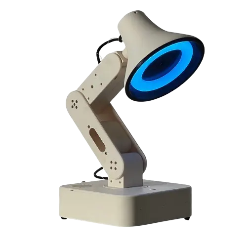
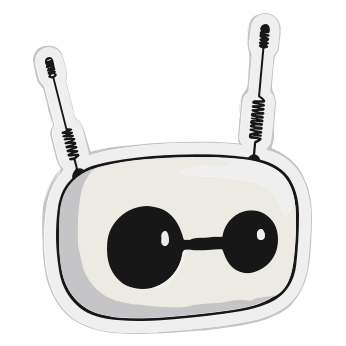
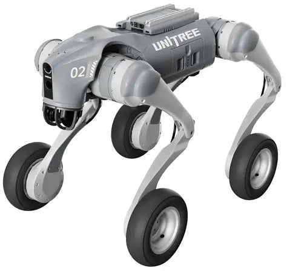
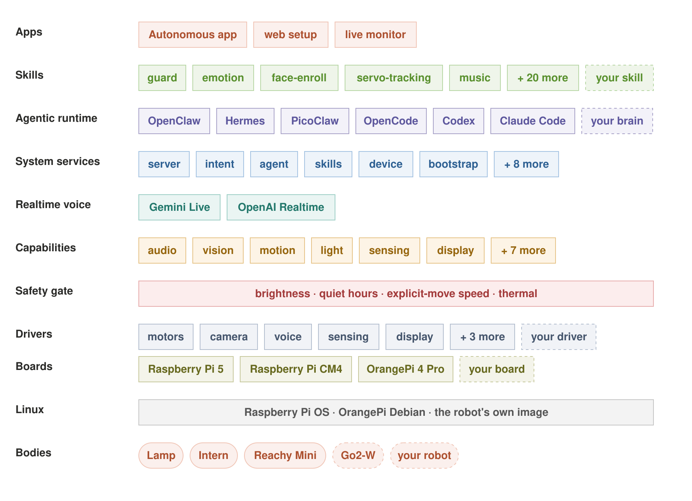

# Autonomous OS

**Autonomous OS is the open source operating system for physical AI agents.** It runs on edge devices
with cameras, microphones, speakers, displays, motors, lights, and sensors, and gives
an AI agent a body: it sees, hears, speaks, moves, senses, remembers, runs skills, and
updates itself — locally first.

**Autonomous Lamp** is the first reference device. **Intern** is the second. Anyone can
build a third.

> The brain is a swappable **agentic runtime** (OpenClaw, Hermes, OpenCode, OpenAI Codex,
> Claude Code, or any LLM + skills + memory). Autonomous OS is everything else — the body, the skills, and the bounds.

## Reference devices

| | Device | What it is | Declares |
|---|--------|-----------|----------|
|  | [**Autonomous Lamp**](devices/lamp) | 5-DOF expressive desk robot | the maximal set — audio, vision, motion, light, display, sensing |
|  | [**Autonomous Intern**](devices/intern-v2) | always-on desk agent | audio, sensing, light — **no** camera, motion, or display |
|  | [**Reachy Mini**](devices/reachy-mini) | Pollen Robotics' desk robot, running Autonomous | audio, vision, motion (6-DOF head + 360° body), expression, sensing — **no** light or display |
|  | [**Unitree Go2-W**](devices/unitree-go2w) | a *different manufacturer's* mobile robot, running Autonomous | audio, vision (+ depth), motion (locomotion), sensing |

Lamp and Intern are **Autonomous's own** devices; **Reachy Mini and the Unitree Go2-W belong to
other manufacturers** and run the identical OS — the Android playbook (Android on Samsung,
Pixel, …). They all run the **same OS image**; only their `DEVICE.md` differs.

**Reachy Mini is where that stops being a claim.** It is someone else's hardware, shipped with
its own vendor OS and daemon, and Autonomous installs *alongside* it —
[one command on the robot](devices/reachy-mini). Onboarding it was writing a `DEVICE.md`, a
motion driver wrapping Pollen's Python SDK, and a `SAFETY.md`. No fork. Its `motion` is a
**Stewart platform** — 6-DOF parallel kinematics, nothing like Lamp's serial bus servos or the
Go2-W's legs — yet a skill calling `motion.aim` runs on all of them, because skills address
capabilities, never hardware.

## Architecture

Autonomous OS is a layered stack: each layer exposes an interface to the one above and
depends only on the one below, so any layer can be replaced without touching the others.



### Skills

What the device does — 24 skills, each a `SKILL.md` the runtime invokes: apps like `guard`,
`mood`, `scene`, `habit`, `wellbeing`, plus capability wrappers (`led-control`,
`servo-control`, `camera`, `music`, …). A skill is an *ability*; the device's *character* is
its `SOUL.md`. First-party skills use the same public contract a third party gets. *(`skills/`)*

### System Managers

The always-on Go daemon: `intent` (fast local commands), `network`, `sensing` routing,
`monitor` (flow event bus), `healthwatch`, `ambient`, and `device`. Deterministic — they run
with or without the runtime. OTA runs as its own worker (`bootstrap/`).
*(`system/`)*

### Agentic Runtime

**OpenClaw**, **Hermes**, **OpenCode**, **OpenAI Codex**, **Claude Code**, or a custom
runtime. Runs the skills, embodies the device's `SOUL.md`, and decides what to act on.
Swappable at runtime (web Settings or MQTT) — and where Autonomous OS's differentiated value
(the default brain, memory, character) lives. Its **tools** — how it reaches beyond the device —
are **MCP connectors** (`runtimes/*/mcp.go`, synced across a switch by `system/agent`) and the
**CLI** the LLM calls directly (`curl`, shell); skills are the device's own abilities through the
HAL, tools are external capabilities the runtime calls.
*(`runtimes/{openclaw,hermes,opencode,codex,claudecode}`; adding
your own: `docs/agentic/adding-agent-runtime.md`)*

### Hardware Abstraction Layer (HAL)

The frozen, versioned interface — 12 capabilities: `audio`, `vision`, `sensing`, `presence`,
`motion`, `light`, `display`, `expression`, `media`, `connectivity`, `companion`, `system`.
Skills call capabilities (`motion.move`), never hardware models — so one skill runs on any
body that declares the capability. A device's `DEVICE.md` declares which it has; the runtime
mounts only those. The HAL also hosts the **safety gate** (`hal/safety`): `SAFETY.md`
bounds — e-stop, motion limits, brightness, quiet hours — **enforced deterministically below
the brain, never by the LLM**.
*(`devices/contract/` + `hal` — see [HAL](docs/architecture/hal.md))*

### Agentic Middle

The realtime voice agent (`hal/realtime`) — brain-tier code the HAL hosts in-process, so it sits
between the runtime and the HAL. Voice turns land here first and it decides per turn: **answer
directly** when the turn is simple (small talk, nothing that needs skills or tools), or **delegate
up** to the main agentic runtime when the turn needs skills or complex tool calls. Runs on Gemini
Live, OpenAI Realtime, or Qwen.
*(`hal/realtime` — see [realtime-voice.md](docs/realtime-voice.md))*

### Linux Kernel

The vendor kernel (Raspberry Pi OS / OrangePi, or the robot's onboard compute) we run on — we
don't ship one. Our **Drivers** (`motors`, `rgb`, `display`, `camera`, `voice` (STT/TTS/VAD),
`gpio`/`touch`, `bluetooth` in `hal/drivers`, with per-board wiring in `hal/board`) are
userspace programs talking to it through GPIO/SPI/ALSA/V4L2;
**Power Management** is the foundation.
*(see [kernel](docs/architecture/kernel.md))*

📖 Full docs: [overview](docs/architecture/overview.md) · [HAL](docs/architecture/hal.md) · [kernel](docs/architecture/kernel.md)

## The Autonomous Physical Agent Standard

Every device is self-describing to both humans and the runtime, in four files:

| File | Role | Consumer |
|------|------|----------|
| `DEVICE.md` | the **body** — what hardware is present | the OS, at boot |
| `SKILL.md` | the **hands** — what it can do | the runtime |
| `SOUL.md` | the **self** — who it is | the runtime |
| `SAFETY.md` | the **bounds** — what it must never do | the OS (deterministic) |

The contract that governs them lives under [`devices/contract/`](devices/contract/) — see
[`DEVICE-SPEC.md`](devices/contract/DEVICE-SPEC.md) and [`capabilities.md`](devices/contract/capabilities.md).

## Repository layout

The tree maps onto the architecture layers (top of the stack first):

```
# The OS
skills/           Skills — the apps (SKILL.md)
system/           System Managers (Go): one folder per manager — intent, network, monitor, OTA…
  web/            on-device setup + monitor UI (React)
runtimes/         Agentic Runtime — one folder per swappable brain (openclaw, hermes, opencode, codex, claudecode)
hal/              HAL (Python) — the package; capability host + routes
  drivers/        Drivers — by subsystem (motion, audio, vision, light, display, sensing)
  board/          Board Support — per-board profiles + declaration-driven mounting
devices/          reference devices: lamp/, intern-v2/, reachy-mini/, unitree-go2w/ (DEVICE · SOUL · SAFETY · README)
  contract/       HAL capability ABI — frozen, versioned (what skills build against)
    cts/          compliance test suite — validates devices against the contract

# Supporting
docs/             documentation, incl. docs/architecture/
scripts/          build, OTA, and SBC image tooling (incl. scripts/imager/)

# Off-device & integrations
integrations/
  companions/          desktop companion apps (autonomous-buddy, claude-desktop-buddy)
  chat-bridges/        chat bridges into the device (Twitch, web chat)
  perception-service/  off-device cloud perception inference
```

> `Drivers` and `Board Support` are surfaced as `hal/drivers` and `hal/board`.

## Quick start

```bash
# Go system services (cross-compiled to linux/arm64 — Pi or OrangePi)
make os-build              # builds the system server (system/)
make os-test               # go test ./...

# Hardware runtime (runs on the Pi or OrangePi)
cd hal && uv sync
make hal-dev               # uvicorn reload on :5001
make hal-test              # pytest

# Web UI
make web-install && make web-dev
```

## API convention

All HTTP endpoints return `{"status": 1, "data": <payload>, "message": null}` on success
and `{"status": 0, "data": null, "message": "error"}` on failure.

## License & contributing

**Apache 2.0** — fully open. Build a device by writing a `DEVICE.md`, a driver, and a
`SOUL.md`; you never fork the OS. PRs welcome — vibe-coded ones too 🤖. See
[CONTRIBUTING.md](CONTRIBUTING.md).
