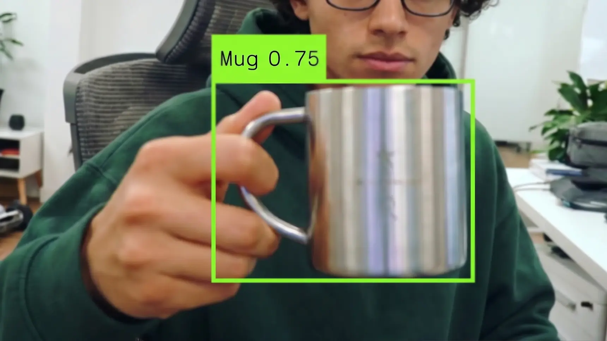

# Autonomous Lamp

**The next personal AI computer is alive.** A computer with a body, eyes, and a mind, made
to live on a desk — the first reference device for [Autonomous](../../README.md).

🔗 **Product page:** https://www.autonomous.ai/lamp

## What it is

An always-on AI desk robot. Unlike a chat window you open on demand, Lamp is *present*: it
sees your workspace, tracks faces and motion, remembers your work, and speaks up when
something is relevant. The articulated arm physically turns to look at you.

## Hardware

| | |
|---|---|
| Form | 5-DOF articulated desk robot |
| Size | 7.87" × 7.87" × 18.43" · 7 kg |
| Motion | 5 servo motors with position feedback |
| Sensing | low-light camera · microphone · speaker |
| Power | USB-C, single cable |
| Compute | Raspberry Pi / OrangePi (ARM64) |
| Colors | Meteor Grey · Pearl White · Stone Beige · Onyx Black |
| Warranty | 2 years |

## Capabilities

The **maximal** device — audio, vision, motion, light, display, sensing, presence. If a
capability works on Lamp, it works. Declared in [`DEVICE.md`](DEVICE.md).

## Privacy

On-device face recognition (the math stays on the device). Data encrypted in transit,
never stored or used for training. Bring your own AI provider. Open-source firmware.

## Status

Coming 2026 — [join the waitlist](https://www.autonomous.ai/lamp).

## For developers

- [`DEVICE.md`](DEVICE.md) — the capability declaration the OS boots from
- [`SOUL.md`](SOUL.md) — the default character (`lamp-companion`)
- [`SAFETY.md`](SAFETY.md) — the deterministic bounds (e-stop, motion limits)
- [Architecture](../../docs/architecture/overview.md)
- [`hardware/`](hardware/) — assembly, wiring, power, BOM, CAD
