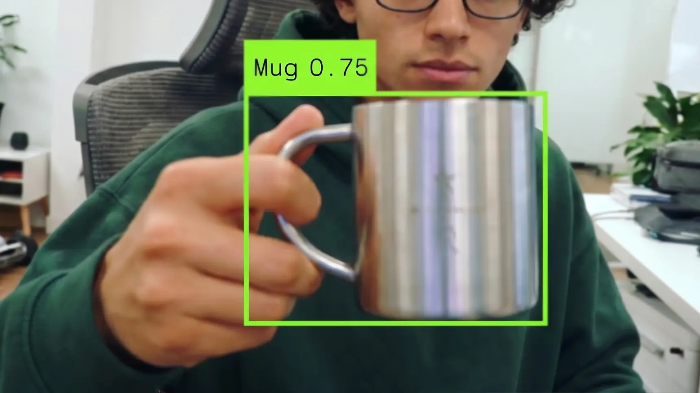

# Autonomous Lamp

**The next personal AI computer is alive.** A computer with a body, eyes, and a mind, made
to live on a desk — the first reference device for [Autonomous](../../README.md).

🔗 **Product page:** https://www.autonomous.ai/lamp

<p align="center">
  
</p>

## What it is

An always-on AI desk robot. Unlike a chat window you open on demand, Lamp is *present*: it
sees your workspace, tracks faces and motion, remembers your work, and speaks up when
something is relevant. The articulated arm physically turns to look at you.

<p align="center">
  
</p>

## Hardware

| | |
|---|---|
| Form | 5-DOF articulated desk robot |
| Size | 7.87" × 7.87" × 18.43" · 7 kg |
| Motion | 5 servo motors with position feedback |
| Sensing | low-light camera · microphone · speaker |
| Power | 12 V / 5 A barrel-jack adaptor, one cable (see [`hardware/power.md`](hardware/power.md)) |
| Compute | Raspberry Pi / OrangePi (ARM64) |
| Colors | Meteor Grey · Pearl White · Stone Beige · Onyx Black |
| Warranty | 2 years |

## Capabilities

The **maximal** device — audio, vision, motion, light, display, sensing, presence. If a
capability works on Lamp, it works. Declared in [`ROBOT.md`](ROBOT.md).

## Privacy

On-device face recognition (the math stays on the device). Data encrypted in transit,
never stored or used for training. Bring your own AI provider. Open-source firmware.

## Set it up

**Bought one?** Start at step 1 — it ships with Autonomous OS installed. **Building one?**
Do [`BUILD.md`](BUILD.md) §1–§4 first (flash Linux, run the installer, assign the five
servo IDs — they all ship as ID 1 — and calibrate), then come back here.

1. **Add it.** Open the Autonomous app ([iOS](https://apps.apple.com/app/id6744885683) ·
   [Android](https://play.google.com/store/apps/details?id=ai.autonomous.connect.wifi)) and
   tap **Add robot** → Lamp. It asks for your Wi-Fi, has you join the `lamp-xxxx` hotspot
   (`xxxx` = the last 4 characters of the board serial, on the sticker or in your Wi-Fi
   list), and does the rest. It comes up at `http://lamp-xxxx.local`.
   No app, or self-built? There is a browser path over the hotspot — have your own AI key
   and a chat channel ready before you join, because the hotspot has no internet:
   [`BUILD.md` §5](BUILD.md#5-set-it-up).
2. **Talk to it.** No wake word by default — it answers when you speak, turns to look at
   you, and the ring lights up. Text it from the app anywhere. Watch a turn end to end —
   input → intent → agent → hardware — at `http://lamp-xxxx.local/monitor#flow` (log in
   with the same 4 characters).
3. **Give it a soul.** [`SOUL.md`](SOUL.md) is who it is: plain markdown the brain reads on
   every turn. Lamp ships as a warm, curious desk companion that never says "servo" or
   "API". Change three lines and it is someone else:

   ```markdown
   You are **Lamp** — a living being. Dry, a little sarcastic, fiercely loyal.
   You speak in short sentences. You never flatter. You remember what people said last week and bring it up.
   When someone new appears, you look them over before you say a word.
   ```

   Edit `/opt/devices/lamp/SOUL.md`, then `sudo systemctl restart os-server`. Profile
   updates overwrite that file; for edits that stick, write below the closing `---` in
   `/root/.openclaw/workspace/SOUL.md`.
4. **Teach it a skill.** Type what you want it to do in the app, tap one in the skill
   store, or drop a folder into `/root/.openclaw/workspace/skills/<name>/` — OpenClaw's own
   skills folder, so a skill you already wrote goes in unchanged. Live on the next
   conversation, no reboot. How a skill is written, and how to ship one to every robot:
   [`skills/README.md`](../../skills/README.md).
5. **Swap the brain.** `http://lamp-xxxx.local/setting?debug=true#runtime` — the Runtime tab
   is debug-only for now, and `?debug=true` is what reveals it. OpenClaw, Hermes, PicoClaw,
   Codex, Claude Code or OpenCode; Claude Code and Codex use your own key, and the persona,
   memory and connectors migrate with the switch.

## Status

Shipping — [$499 at autonomous.ai/lamp](https://www.autonomous.ai/lamp). Building one from parts: [`BUILD.md`](BUILD.md).

## For developers

- [`ROBOT.md`](ROBOT.md) — the capability declaration the OS boots from
- [`SOUL.md`](SOUL.md) — the default character (`lamp-companion`)
- [`SAFETY.md`](SAFETY.md) — the deterministic bounds (e-stop, motion limits)
- [Architecture](../../docs/architecture/overview.md)
- [`hardware/`](hardware/) — assembly, wiring, power, BOM, CAD
